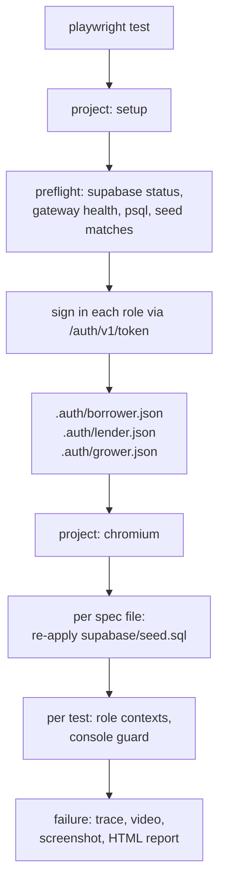

# The browser suite

The plan is [`docs/02-browser-testing.md`](../../../docs/02-browser-testing.md). This file is the
harness: what exists, how to run it, and **how to add a journey**, which is the only part most
readers need.

## Adding a journey

One file. Put it in `system/`, `functional/` or `visual/` and import `test` from the fixtures
rather than from Playwright:

```ts
import { expect, test } from '../fixtures/test';

// Say what this file needs from the database. 'reset-per-file' is the default
// and re-seeds once before the file's first test; 'shared' opts out, and is only
// honest for a file that asserts nothing about data.
test.use({ database: 'reset-per-file' });

test('the lender sees the file the borrower submitted', async ({ borrowerPage, lenderPage }) => {
  await lenderPage.goto('/lender/queue');
  await expect(lenderPage.getByRole('row', { name: /Fenwick Grain/ })).toBeVisible();

  // Two roles, two contexts, one test. Neither can see the other's session.
  await borrowerPage.goto('/applications');
  await expect(borrowerPage.getByText('With your lender')).toBeVisible();
});
```

That is the whole setup cost. What you get for free:

| Fixture | What it is |
|---|---|
| `borrowerPage`, `lenderPage`, `growerPage` | A page in its own browser context, already signed in as that seeded account. Use two in one test to assert what one role can see and the other cannot. |
| `page` | The ordinary Playwright page, signed in as nobody. |
| `stack` | `{ url, anonKey, serviceRoleKey, dbUrl }`, read from `supabase status` at run time. For asserting on the API directly, which is the only way to prove a field never reached the browser. |
| `database` (option) | `reset-per-file` or `shared`. |
| `failOnConsoleError` (option) | Defaults to `true`. Every test fails if the browser logged an error, without having to ask. |
| `freezeClock(page, when)` | A fixed wall clock, for anything that renders a date or an expiry. |

The accounts are the seeded ones from [`supabase/seed.sql`](../../../supabase/seed.sql):
`borrower@example.test` holds a draft stopped mid-form and an approved application,
`grower@example.test` holds one under review, and `lender@example.test` is the lender for both.
`fixtures/accounts.ts` names what each one is for.

## What a run does



If the setup project fails, nothing else runs, and the message names the thing to fix.

## Running it

```bash
supabase start                       # the stack from docs/01-local-development.md
pnpm exec playwright test            # everything, on the host
pnpm exec playwright test --ui       # pick a test, step through it, read the trace
apps/web/e2e/run-in-container.sh     # the same suite in the official image
```

Visual baselines must be produced and compared **inside the container** and nowhere else. Font
rasterisation differs between distributions, so a baseline captured on a laptop will never match
one captured in CI. `run-in-container.sh` is the only supported way to run
`--update-snapshots`.

## Decisions worth knowing before you argue with them

Each is argued where it is implemented; this is the index.

- **Reset per spec file, one worker** -- `fixtures/database.ts`. The seed holds the interesting
  states and journeys mutate them, so files must not inherit each other's leftovers. There is one
  local Postgres, so a second worker would reset the database under the first.
- **Reset means re-applying `supabase/seed.sql`, not `supabase db reset`** -- same file. The seed
  deletes its own previous generation by fixed id, so it is repeatable, and it does not replay
  migrations or destroy anything else on the stack.
- **No retries, ever** -- `playwright.config.ts`. A retry turns a flake into a green run.
- **No key is written to a file in this repository** -- `fixtures/stack.ts`. Keys come from
  `supabase status -o json` at run time, the same way `packages/db/test/rls.spec.ts` does it.
- **Sessions are saved by calling the auth API, not by driving the login form** -- `fixtures/auth.ts`.
  The login form is exercised once, by the auth journey; everywhere else it is setup cost.

## Recording a defect you must not fix

qa owns no application source. When the suite finds a defect, the finding goes in the suite, not
in a comment: put the correct assertion in a `test.describe` with `test.fail(true, 'why')` above
it. It fails today, so the run stays green and the defect is written down where it runs. The day
someone fixes the app, Playwright reports "expected to fail but passed" and the marker comes out.
`system/shell.spec.ts` has a worked example.

## Two things the next scope has to close

1. **The storage-state contract is only half verified.** `system/harness.spec.ts` proves the
   session round-trips and that the token is live, but it reads the key the harness itself wrote.
   `apps/web` has no Supabase client yet, so nothing has confirmed the app reads
   `sb-127-auth-token`. Whoever adds authentication to the web app should check it, and set
   `E2E_AUTH_STORAGE_KEY` rather than editing a test if the app uses a different key.
2. **Visual projects are not declared.** `playwright.config.ts` says where they go and what they
   need. They were left out because none of the surfaces they photograph exist yet, and a project
   matching no files is a project whose missing baselines nobody notices.
