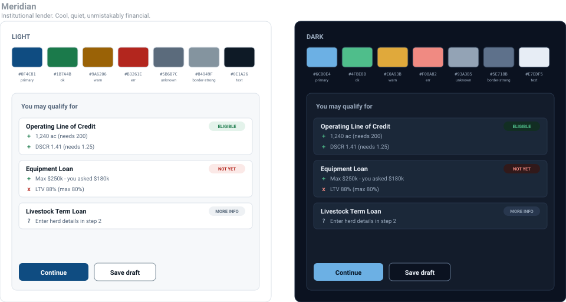

# Theme 01 - Meridian

> Institutional lender. Cool, quiet, unmistakably financial.

*Light and dark, with the palette and the application's signature surface - the eligibility card
from `plan/05-option2-application.md`. Generated from `tokens.json` by `preview.py`.*

## Character

Meridian is the palette of an institution that lends money. Deep navy, cool grey
neutrals, and nothing decorative. It says "your bank" rather than "a startup," and it does that
without a single agricultural cue - the credibility comes from restraint.

The navy is dark enough (8.86:1 on white) to carry body text, links, icons and filled buttons
from one token, which keeps the theme small.

## Pick this if

- The lender-facing surfaces matter most to you. The queue, the decision screen and the
  document review all read as serious tooling in this palette.
- You want the safest possible reading from an assessor who works in fintech.
- You want the least risk of a colour clash: navy collides with none of the four status tones,
  so a primary button and a status pill can never be confused.

## Avoid this if

- You want the app to look distinctive. Meridian is the palette a dozen other submissions
  will land near, because it is the obvious correct answer.
- You want any sense of the agricultural domain in the chrome. There is none here by design.

## Tokens

| Token | Light | Dark | Role |
|---|---|---|---|
| `--lj-bg` | `#FFFFFF` | `#0B1220` | Page ground. The only thing behind everything else. |
| `--lj-surface` | `#F6F8FA` | `#131C2B` | Recessed panels: the rule-list card, the form step body. |
| `--lj-raised` | `#FFFFFF` | `#1B2839` | Cards sitting on a surface: a product row, a document slot. |
| `--lj-border` | `#DDE3EA` | `#26344A` | Decorative separators. Low contrast on purpose. |
| `--lj-border-strong` | `#84949F` | `#5E718B` | Real affordances: input outlines, outlined buttons. 3:1 minimum. |
| `--lj-text` | `#0E1A26` | `#E7EDF5` | Primary copy. |
| `--lj-muted` | `#54657A` | `#9AAABE` | Secondary copy, labels, helper text. Never below 4.5:1. |
| `--lj-primary` | `#0F4C81` | `#6CB0E4` | Primary action, active nav, focus ring, links. |
| `--lj-primary-hover` | `#0C3D68` | `#8AC2EC` | Hover and pressed state for primary. |
| `--lj-on-primary` | `#FFFFFF` | `#08192B` | Text and icons sitting on primary. |
| `--lj-primary-subtle` | `#E7F0F8` | `#16304A` | Selected rows, active step, primary-tinted banners. |
| `--lj-ok` | `#1B7A4B` | `#4FBE8B` | RuleResult status 'pass'. Also the 'accepted' document slot. |
| `--lj-ok-subtle` | `#E4F3EB` | `#122E23` | Background for a pass pill or banner. |
| `--lj-warn` | `#9A6206` | `#E0A93B` | Advisory severity: a consistency warning that does not block. |
| `--lj-warn-subtle` | `#FBF0DC` | `#2E2515` | Background for a warning pill or banner. |
| `--lj-err` | `#B3261E` | `#F08A82` | Blocking severity: a failed guard, a rejected document. |
| `--lj-err-subtle` | `#FBE9E7` | `#31191A` | Background for an error pill or banner. |
| `--lj-unknown` | `#5B6B7C` | `#93A3B5` | RuleResult status 'unknown' - not enough entered yet. |
| `--lj-unknown-subtle` | `#EEF1F4` | `#28374E` | Background for the 'more info needed' pill. |

Every pair is verified by `preview.py`: text tokens meet 4.5:1 against the ground they sit on,
`border-strong` meets 3:1, and each status tone meets 4.5:1 against `bg`, `surface` and its own
`-subtle` background, in both modes. Run `python3 design/preview.py` after any edit; it exits
non-zero on a failure.

## Known risks

**It is forgettable.** That is the trade: minimum risk, minimum signature. Mitigate with
typography and density rather than colour - see `00-foundations.md`.

**Navy-on-navy in dark mode.** The dark primary (`#6CB0E4`) is a lightened tint, not the same
navy. Do not attempt to reuse `#0F4C81` on a dark ground; it fails contrast badly. The token
contract handles this, but it is the mistake to watch for in review.

## Angular Material 3 notes

Material 3 source colour `#0F4C81`. Generate with a **neutral** tonal palette rather
than the content-derived default, otherwise M3 tints the greys blue and the tables get muddy.
Set `$tertiary` to the `ok` green so M3's own success surfaces agree with `packages/ui`.
