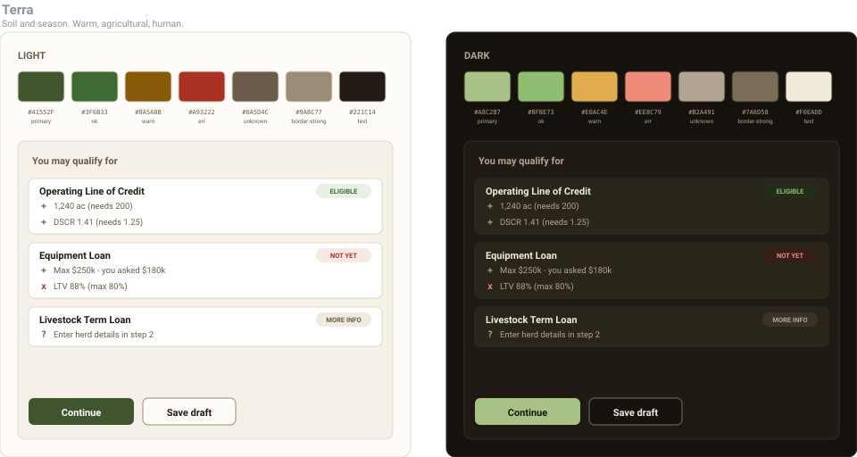
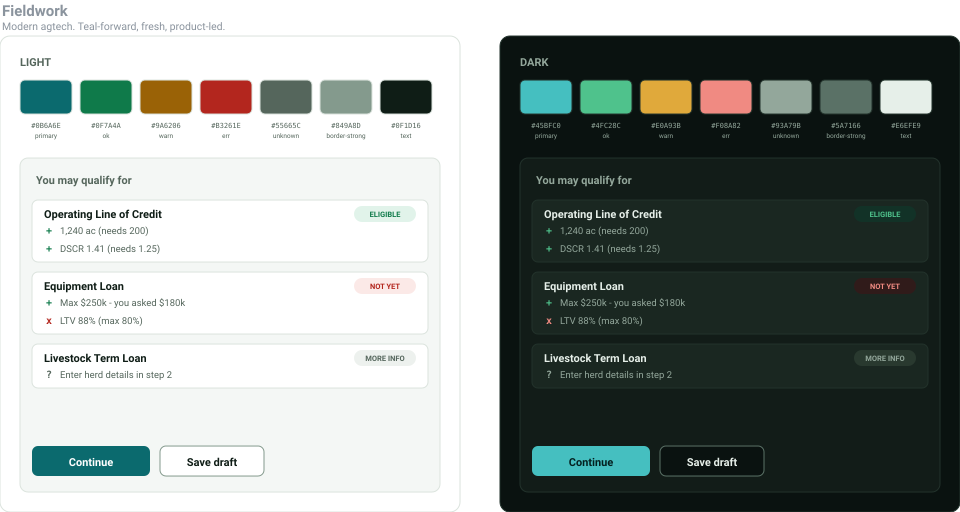
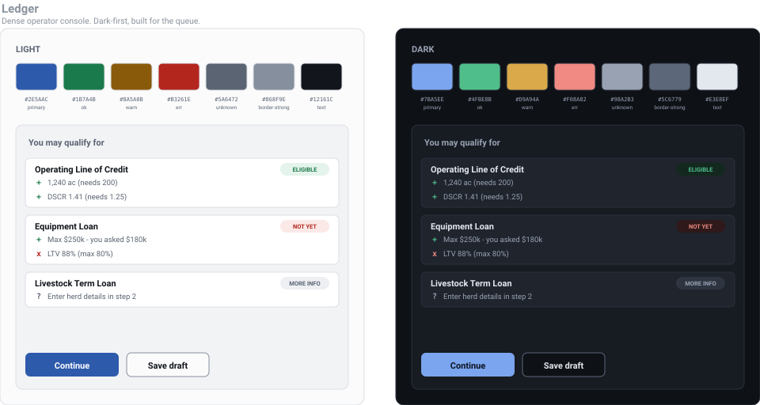

# Visual design

Four complete, contrast-verified themes for the Landjourney build. **Pick one.** Every other
design decision - type, spacing, density, motion, status semantics - is in `00-foundations.md` and
is identical whichever you choose.

Each preview below shows the palette and the application's signature surface (the eligibility card
from `plan/05-option2-application.md`) in light and dark. They are generated from `tokens.json`, so
what you see is exactly what ships.

---

## 01 - Meridian
> Institutional lender. Cool, quiet, unmistakably financial.


[Full guide](01-theme-meridian.md) - safest reading, zero colour collisions, least distinctive.

---

## 02 - Terra
> Soil and season. Warm, agricultural, human.



[Full guide](02-theme-terra.md) - the only one that looks like agriculture; has one real hue
tension to manage.

---

## 03 - Fieldwork
> Modern agtech. Teal-forward, fresh, product-led.



[Full guide](03-theme-fieldwork.md) - distinctive and professional; teal primary is deliberately
separated from the success green.

---

## 04 - Ledger
> Dense operator console. Dark-first, built for the queue.



[Full guide](04-theme-ledger.md) - best for the lender surfaces, hardest to get right in light
mode.

---

## Choosing

| | Meridian | Terra | Fieldwork | Ledger |
|---|---|---|---|---|
| Best for | lender screens | borrower forms | both | lender queue |
| Distinctiveness | low | high | medium-high | medium |
| Risk of looking generic | high | low | low | medium |
| Colour collisions | none | primary vs. success | none | none |
| Effort to get right | lowest | medium | low | highest (two real modes) |
| Reads as | a bank | a farm co-op | a product | a terminal |

**If you want a recommendation: Fieldwork.** It is the only candidate that is distinctive without
being a risk. The teal primary keeps an agricultural association while sitting far enough from the
success green that a filled button and a pass indicator can never be confused - which matters more
than usual here, because this application's core surface is a list of pass/fail results. Meridian
is the safe second choice; take it if the lender-facing screens are what you intend to demo.

The brief states outright that visual design polish is **not** assessed. So the value of this
folder is not prettiness - it is that a coherent token contract makes "a loan officer could move
through it quickly" achievable, and gives you a real answer when the CTO asks why the interface
looks the way it does.

## Files

| File | Contents |
|---|---|
| `00-foundations.md` | Type, spacing, density, motion, status semantics, dark mode, a11y floor |
| `01-theme-meridian.md` | Institutional navy |
| `02-theme-terra.md` | Warm earth |
| `03-theme-fieldwork.md` | Agtech teal |
| `04-theme-ledger.md` | Dark-first console |
| `05-implementation.md` | Tokens to CSS variables, Tailwind, Material M3, verification |
| `tokens.json` | Source of truth for all four palettes |
| `preview.py` | Generates `preview/*.svg` and enforces WCAG contrast; exits non-zero on failure |

## Regenerating

```bash
python3 design/preview.py
```

Rewrites every SVG and re-checks every colour pair: text at 4.5:1, UI boundaries at 3:1, in both
modes. It is wired into CI as `pnpm tokens:check` (`plan/08-cicd.md`), so a palette edit that
breaks contrast fails the build rather than reaching a screen.

After picking, follow `05-implementation.md` section 6: delete the unused theme guides and trim
`tokens.json` to one theme.
