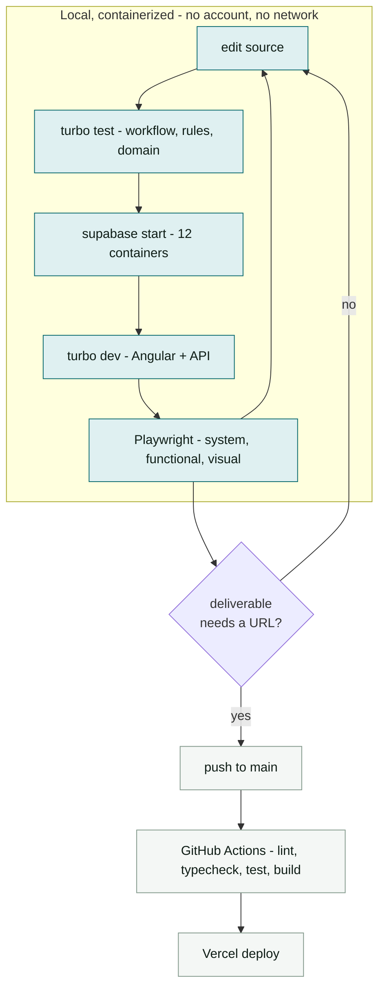

# Local-first development

**The inner loop runs entirely on this machine, in containers, with no cloud account involved.
Publishing is a separate, deliberate act.** The rule is in `../CLAUDE.md`; this document is the
evidence behind it and the commands that implement it.

## The loop



Everything in the tinted box works with the network unplugged once dependencies are installed.

## Validation

The claims above were measured on this machine on 2026-09-01, not assumed.

| Claim | Result |
|---|---|
| The Supabase stack runs locally in containers | **Yes.** 12 containers: Postgres 17.6, GoTrue (auth), PostgREST, Storage, Realtime, Kong, Studio, Mailpit, edge runtime, analytics, vector, pg-meta |
| Disk cost | **~2.5 GB** across 10 images |
| Start time, images cached | **42 s** to all 12 healthy |
| Signup and login work offline | **Yes.** `POST /auth/v1/signup` then `token?grant_type=password` returned a JWT with `role=authenticated` |
| Row-level security is enforced locally | **Yes.** Table with 2 rows and a `borrower_id = auth.uid()` policy: anonymous request returned 0 rows, the authenticated borrower returned exactly 1 |
| Confirmation mail is catchable | **Yes.** Mailpit on `:54324`. Local config ships with `enable_confirmations = false`, which is why signup logs in immediately; turn it on in `supabase/config.toml` to exercise the confirm flow |
| Docker available | 29.7.2, Compose v5.5.0 |

So the brief's requirement of "working signup and login, not stubbed" is fully satisfiable without
ever touching a hosted Supabase project.

## Ports

| Port | Service |
|---|---|
| 54321 | API gateway - REST, Auth, Storage, Realtime, Functions |
| 54322 | Postgres |
| 54323 | Studio |
| 54324 | Mailpit |

These are fixed by `supabase/config.toml`. If another project is already on them - check
`docker ps` first - change them there rather than working around a clash.

## Commands

```bash
pnpm i                     # once
supabase start             # 42s, brings up the stack
pnpm db:reset              # supabase db reset: migrations + seed
pnpm dev                   # turbo dev, Angular + serverless API
pnpm test                  # unit tests, no containers needed
pnpm e2e                   # Playwright, needs the stack up - see 02-browser-testing.md
supabase stop --no-backup  # tear down
```

`pnpm db:reset` is the **only** way schema changes are applied. The hosted dashboard is for
inspection, never for editing: a change clicked into the cloud does not exist in
`supabase/migrations/`, so it does not exist.

## Secrets

The local stack issues its own keys. They are printed by `supabase status`, they are identical on
every machine, and they are worthless outside `127.0.0.1`.

**They still never enter the repository.** `.env.example` holds names and shapes; `.env.local` is
git-ignored. This costs nothing and it means the day a real key exists, the habit is already
right. The service role key is API-side only, in every environment - see the security rules in
`../CLAUDE.md`.

## What genuinely cannot be local

Be honest about the boundary rather than pretending it is not there.

- **Vercel's runtime.** Serverless functions run on Node locally but not on Vercel's exact
  runtime, and routing, headers and cold-start behaviour differ. `vercel dev` narrows the gap but
  needs an account. The mitigation is that `apps/api` holds no business logic - the engines it
  calls are pure and fully tested locally - so what can differ is thin.
- **The deploy itself**, and the live URL the brief requires as a deliverable.
- **GitHub Actions.** Runnable locally with `act`, which is itself containerized, but the runner
  image is not identical to GitHub's.

### Local-first is not "publish last"

Prove the deployment path **early, once, on an empty app**. That is Phase 0 in
`../plan/09-build-order.md`, and it exists because a pipeline first exercised at the end fails at
the end, when there is no time left to fix it. Local-first governs the daily loop; it is not a
licence to leave the publish path unproven until the deadline.

## Toolchain

Versions are pinned in one place: the table in `../plan/01-architecture.md`. Do not repeat them
here or set them independently in CI.

One trap worth repeating because it is silent: npm's `latest` TypeScript is a major release that
Angular 22 refuses (`"typescript": ">=6.0 <6.1"`). Pin `6.0.3` exactly.

### Four traps that cost real time, in the order they bite

Each of these was found by something failing in a way that named the wrong cause. They are written
here rather than left in issue threads because every one of them will be met again.

**The Node version manager does not fire in a non-interactive shell.** `.node-version` pins
24.20.0, and the `fnm` hook that reads it sits in `~/.bashrc` *after* the guard that returns early
when the shell is not interactive. So an interactive prompt gets 24.20.0 and any scripted command
gets the machine's global Node, silently. Prefix commands that matter:

```bash
fnm exec -- pnpm turbo run test        # reads .node-version
node -v                                # may be a different major entirely
```

**A relative import inside a package names a `.ts` file.** Packages are consumed as TypeScript
source, so `./thing.js` describes a file that does not exist and Node refuses it at load. This is
recorded in `../plan/01-architecture.md`; it cost three deploys to establish, because the compiler
is content with a specifier it will never emit.

**A serverless function must not import a workspace package.** Vercel's zero-config builder
transpiles the entry and leaves imports to resolve on the server, where a pnpm-symlinked package
is simply absent. `apps/api` therefore bundles its handlers -- see `../plan/01-architecture.md`.
The failure is a 500 with no application log, because nothing ran.

**Local auth and hosted auth differ.** `supabase/config.toml` sets
`enable_confirmations = false`, so a local signup logs straight in. The hosted project confirms
addresses and has no mail service, so the same signup succeeds and can never authenticate -- and
the login is refused with `invalid_credentials` rather than anything about confirmation, which is
deliberate on Supabase's part and unhelpful on ours. The demo accounts exist for this reason; see
`04-demo-accounts.md`.
