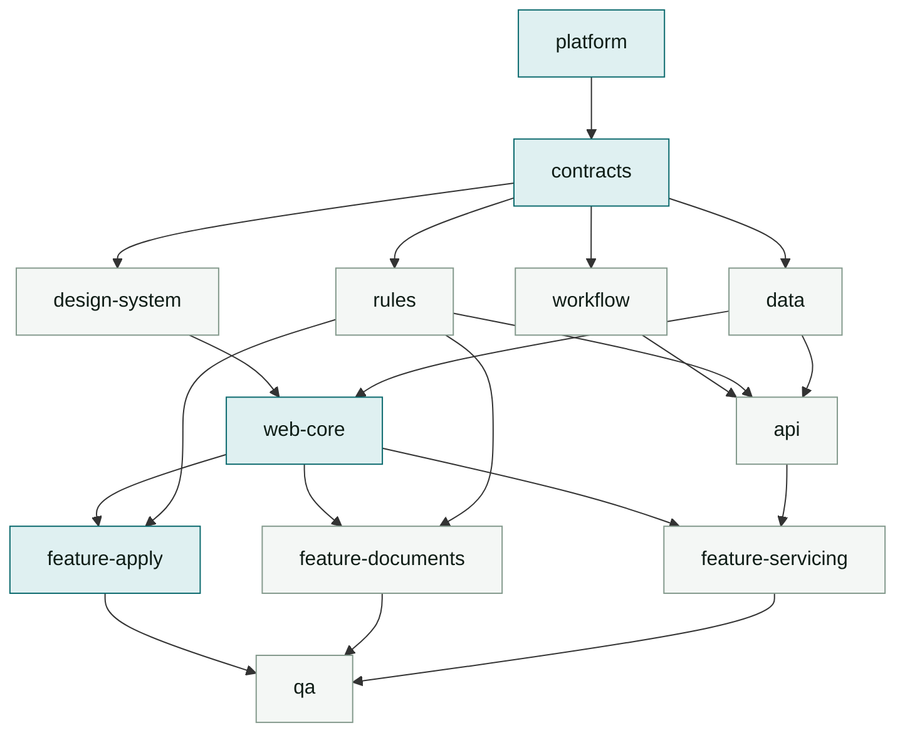

# Agent responsibility scopes

`../CLAUDE.md` (**Working as one of several agents**) states the rule: every issue names the paths
it owns, one agent per issue, and an agent edits only those paths. This document is the concrete
partition - who owns what, who must wait for whom, and how many agents can usefully run at once.

The partition is not arbitrary. It is the layering rule from `../CLAUDE.md` (**Layered design**)
projected onto people: layers that cannot import each other are also layers that cannot edit each
other's files, which is what makes concurrent work safe rather than merely fast.

## The twelve scopes

Estimates come from [`../plan/09-build-order.md`](../plan/09-build-order.md), which owns them;
they are repeated here only as a schedule input. "Must not touch" is the load-bearing column - it
is what an agent reads before its first edit.

| # | Scope | Owns | Must not touch | Waits for | Est |
|---|---|---|---|---|---|
| 1 | **platform** | `tooling/`, `turbo.json`, `pnpm-workspace.yaml`, root `package.json`, `.github/workflows/`, Vercel project config, `supabase/config.toml`, the Angular workspace shell (`angular.json`, `src/main.ts`, `src/index.html`, `src/styles.scss`), and the **initial scaffold only** of `apps/*` and `packages/*` | the *contents* of any app or package once scaffolded, including `app.config.ts` and `app.routes.ts` after it has generated them | - | 1.0 h |
| 2 | **contracts** | `packages/domain/`, `supabase/migrations/0001_init.sql`, `supabase/seed.sql` | every consumer of the types it defines | platform | 1.0 h |
| 3 | **workflow** | `packages/workflow/`, the generated transitions migration | `packages/domain` (consume only) | contracts | 1.5 h |
| 4 | **rules** | `packages/rules/` | `packages/workflow` | contracts | 1.0 h |
| 5 | **design-system** | `packages/ui/`, `design/tokens.json`, the token emitter | any `features/` directory | contracts | 1.0 h |
| 6 | **data** | `packages/db/`, the RLS policy migrations | `packages/domain`, `apps/` | contracts | 1.0 h |
| 7 | **api** | `apps/api/` | `packages/*` | workflow, rules, data | 0.75 h |
| 8 | **web-core** | `apps/web/src/app/core/`, `app.config.ts`, `app.routes.ts`, the root `app.*` component, `shared/` | any `features/` directory | design-system, data | 1.0 h |
| 9 | **feature-apply** | `apps/web/src/app/features/apply/` | `core/`, `packages/*`, other features | web-core, rules | 2.5 h |
| 10 | **feature-documents** | `apps/web/src/app/features/documents/` | as above | web-core, rules | 1.5 h |
| 11 | **feature-servicing** | `apps/web/src/app/features/servicing/` **and** `features/lender/` | as above | web-core, api | 2.0 h |
| 12 | **qa** | `apps/web/e2e/`, `playwright.config.ts` | application source - it reports, it does not fix | the features it exercises | 1.5 h |

### Four boundaries that are deliberate

**platform scaffolds every app and package, then never returns.** Phase 0 in
[`../plan/09-build-order.md`](../plan/09-build-order.md) requires an Angular app, an API and five
empty packages to exist before any other scope can start, so platform must create them; a scope
that may not touch `apps/` or `packages/` at all cannot execute its own phase. The line is
scaffold versus contents. Scaffold is the manifest, the tsconfig, and an `index.ts` that exports
nothing - enough that the workspace graph resolves and `typecheck` passes. Contents are what the
owning scope writes afterwards. Once a package has an owner, platform edits it only through that
owner's issue, exactly like any other contended file.

That definition is exact for the five packages and useless for `apps/web`, because `ng new` is not
decomposable: it emits an app shell in one step, and two of the files it emits - `app.config.ts`
and `app.routes.ts` - are named in web-core's row below. Splitting the generator's output is not
possible, so ownership is split instead, at the moment of the scaffold commit:

| File | Owner after Phase 0 |
|---|---|
| `angular.json`, `src/main.ts`, `src/index.html`, `src/styles.scss` | platform - workspace shell, the same standing as `tooling/` |
| `src/app/app.config.ts`, `src/app/app.routes.ts` | web-core, from the scaffold commit onward |
| `src/app/app.*` (the root component) | web-core |

Platform generates all of them and edits none of them again. web-core's files must be left in
their generated-empty state - an empty `routes` array, a `providers` array with only what
bootstrapping requires - so that web-core's first commit is a handoff rather than a second author
in a populated file. The `touched:` line of platform's closing comment must list both, so the next
agent knows they already exist.

**Servicing and lender are one scope, not two.** Option 3's whole subject is two roles reading
different truths from one record (`../plan/06-option3-servicing.md`). Splitting borrower and
lender across two agents puts the two halves of a single invariant in two heads, and the failure -
a borrower's available credit disagreeing with the guard that validates it - is exactly the bug
the feature exists to avoid.

**qa owns no application source.** An agent that can fix what it finds will fix it, and then the
test and the code have one author and prove nothing. qa reports on the issue thread; the owning
scope fixes.

## Dependencies



The tinted path is the critical path. Nothing shortens it by adding agents.

## How many agents can actually work at once

Twelve scopes does not mean twelve agents. The useful measure is the peak width of the graph:

| Wave | Concurrent scopes | Wall time |
|---|---|---|
| 0 | platform | 1.0 h |
| 1 | contracts | 1.0 h |
| 2 | workflow, rules, design-system, data | 1.5 h |
| 3 | api, web-core | 1.0 h |
| 4 | feature-apply, feature-documents, feature-servicing | 2.5 h |
| 5 | qa (harness lands in wave 3; the suite is the tail) | 1.0 h |
| 6 | submission | 1.0 h |

**The 16.75 hours in [`../plan/09-build-order.md`](../plan/09-build-order.md) compress to about 9
hours of wall time, at a peak of four concurrent agents.** That is a speed-up of roughly 1.9x, not
12x, and the ceiling is the serial spine: platform, then contracts, then core, then the largest
feature, then submission.

Three consequences worth acting on:

- **Running more than four agents on this project wastes them.** A fifth has nothing to own that
  is not already owned, so it either idles or edits someone else's paths.
- **Waves 0 and 1 are strictly single-agent.** Everything imports the domain types; starting a
  feature before they exist means writing against types that will change, and rewriting is slower
  than waiting.
- **The way to go faster is to shorten the spine, not to widen the fan-out.** Landing `contracts`
  in 30 minutes with a deliberately thin first cut saves more than two extra agents ever will.

## Contended files

`../CLAUDE.md` names these as shared contracts. Each has a protocol, because "be careful" is not
one.

| File | Owner | Protocol for everyone else |
|---|---|---|
| `packages/domain/**` | contracts | Needs a change? Comment on the contracts issue with the type you need and stop. Do not add a local copy. |
| `design/tokens.json` | design-system | Needs a colour that does not exist? The contract is wrong - ask for it to be extended for the whole theme, never hardcode one. |
| `turbo.json`, `tooling/**` | platform | Comment on the platform issue. A task added ad hoc breaks the changed-only build in a way nobody notices for a day. |
| `supabase/migrations/**` | see below | Append-only. |
| generated files | the generator's owner | Never hand-edit. Change the source and regenerate. |

**Migrations are append-only, one owner per file.** `contracts` owns the initial schema; any scope
may add its own forward migration with a fresh timestamp. Two rules make that safe: never modify a
migration that is already committed, and a migration that alters a table another scope owns
belongs to that scope's issue, not yours. Timestamped filenames mean two agents adding migrations
rarely collide textually - but they can collide semantically, which is what the second rule is for.

## Handoff contracts

A scope is not done when its code works. It is done when the scopes waiting on it can start. Each
of these must be posted to the issue thread before `status: ready-for-review`:

| Scope | Must publish |
|---|---|
| platform | The commands that work: `pnpm i`, `pnpm dev`, `pnpm test`, and a green CI run |
| contracts | The exported type names and the migration that creates them; a `pnpm db:reset` that succeeds |
| workflow | The machine ids, the transition API signature, and the shape of `GuardResult` |
| rules | The `RuleResult` shape as built, and the rule ids each surface can render |
| design-system | The component selectors and their inputs; the emitted token file path |
| data | The query helpers and which RLS policies are live |
| api | The route list with request and response shapes |
| web-core | The store base class, the route structure, and how a feature registers itself |
| features | The routes added and the seed state needed to demo them |

The thread is the only channel (`../CLAUDE.md`). An interface agreed in an agent's own context and
never written down does not exist, because that context ends.

## How this fails

Named so they can be recognised early rather than diagnosed late.

- **A feature agent starts before `web-core`.** It invents its own store, its own API client and
  its own auth handling. All three are then duplicates that must be removed, and removing them
  touches files three other agents own. This is the most expensive failure available here.
- **Two agents both need a domain type.** Both add it locally rather than blocking. The two copies
  diverge, and nothing detects it until a runtime mismatch - the exact case `../CLAUDE.md`
  (**No duplication**) exists to prevent.
- **An agent works around a conflict instead of stopping.** Forbidden outright by the rules, and
  it is worth restating because it always looks like the productive choice in the moment.
- **qa fixes what it finds.** The suite stops being independent evidence.
- **Silence.** An agent that stops reporting is indistinguishable from one that crashed, and
  establishing which costs someone an hour.

## Issue body template

```
scope:      feature-documents
owns:       apps/web/src/app/features/documents/
must-not:   apps/web/src/app/core/, packages/*, other features/
waits-for:  #4 web-core, #6 rules
publishes:  routes added, seed state needed to demo
done-when:  tests first and passing; CI green; layering intact;
            plain ASCII; only owned paths touched
```

`owns` and `must-not` are both required. Stating only what an agent owns leaves the boundary to
inference, and inference is what produces two agents in one file.
