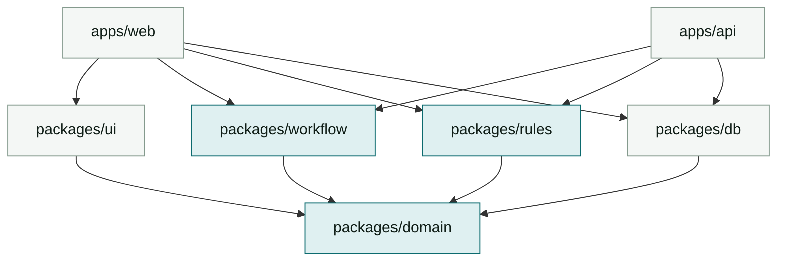

# Plan 01 -- Repo & Build Architecture

Addresses assessment criteria #2 (repo/monorepo structure) and #4 (CI/CD).

## Layout

```
agentic-assignment/
+-- apps/
|   +-- web/                 Angular 22 app  -> Vercel project "lj-web"
|   +-- api/                 Vercel serverless functions (Node 22, TS)
+-- packages/
|   +-- domain/              Entities, Zod schemas, shared TS types. Zero deps.
|   +-- workflow/            State machine engine + the 3 machine definitions
|   +-- rules/               Rule engine + eligibility / document / credit rule sets
|   +-- db/                  Supabase generated types, client factories, query helpers
|   +-- ui/                  Shared Angular standalone components (design primitives)
+-- supabase/
|   +-- migrations/          Timestamped SQL, checked in
|   +-- seed.sql             Demo lender, products, borrower, one funded loan
+-- tooling/
|   +-- eslint-config/
|   +-- tsconfig/            base.json, angular.json, node.json
+-- .github/workflows/ci.yml
+-- turbo.json
+-- pnpm-workspace.yaml
```

**Dependency direction is strictly one way:**



An arrow reads "depends on". Nothing points upward, and `packages/domain` depends on nothing.
The tinted nodes are the pure layer.

`domain`, `workflow`, and `rules` are **pure TypeScript with no I/O and no framework imports.**
That is what lets the browser and the serverless function run byte-identical logic -- the client
predicts the transition for instant UI, the server decides it. See `03`.

## Package manager & tooling

- **pnpm workspaces** (`pnpm-workspace.yaml`). Chosen over npm for strict node_modules -- it
  surfaces phantom dependencies, which matters when five packages share one graph.
- Internal packages are consumed as **TS source, not built dist** (`"exports": "./src/index.ts"`,
  `publishConfig` unused). One less build step; Angular's and Vercel's bundlers both handle it.
  Trade-off: `typecheck` must run repo-wide, which it does anyway.

## turbo.json

```jsonc
{
  "$schema": "https://turbo.build/schema.json",
  "globalDependencies": ["pnpm-lock.yaml", "tooling/tsconfig/**"],
  "tasks": {
    "build": {
      "dependsOn": ["^build", "typecheck"],
      "outputs": ["dist/**", ".angular/cache/**"],
      "env": ["SUPABASE_URL", "SUPABASE_ANON_KEY", "VERCEL_ENV"]
    },
    "typecheck": { "dependsOn": ["^typecheck"], "outputs": [] },
    "lint":      { "dependsOn": ["^lint"], "outputs": [] },
    "test":      { "dependsOn": ["^build"], "outputs": ["coverage/**"] },
    "dev":       { "cache": false, "persistent": true }
  }
}
```

Note `env` on `build`: Turbo hashes those into the cache key, so a changed Supabase URL
correctly busts the cache instead of serving a stale bundle. This is the classic monorepo
footgun and is worth mentioning in the interview.

## "Vercel builds only what changed"

The brief names this explicitly, so it must actually work and be demonstrable.

Two Vercel projects (`lj-web` -> `apps/web`, `lj-api` -> `apps/api`), both with **Root Directory**
set to the app and **Ignored Build Step** set to:

```bash
npx turbo-ignore --fallback=HEAD^1
```

`turbo-ignore` asks Turbo whether the app's dependency subgraph changed between the last
successful deploy's SHA and this one. Editing `packages/rules` rebuilds both apps; editing
`apps/web/src/styles.css` rebuilds only web; editing `README.md` rebuilds neither.

**Demonstrate it in the submission README** with two commits and two screenshots of the Vercel
log ("Build cancelled -- no changes detected"). An unproven claim here is worth nothing.

Remote cache: link the repo with `npx turbo login && npx turbo link` so CI and Vercel share
artifacts. In GitHub Actions, pass `TURBO_TOKEN` / `TURBO_TEAM` -- see `08`.

## Local dev

```bash
pnpm i
supabase start                 # local Postgres + Auth on :54321
pnpm db:reset                  # migrations + seed
pnpm dev                       # turbo dev --filter=web --filter=api
```

`pnpm db:reset` = `supabase db reset` -- migrations are the only way schema changes happen. No
clicking in the Supabase dashboard; the dashboard is for inspection.

## Why an `apps/api` at all, given Supabase

Supabase RLS could serve the whole app from the browser. We add a thin serverless API for one
reason: **workflow transitions must be adjudicated somewhere the client cannot lie.** Reads go
direct to Supabase (RLS-protected, fewer hops, realtime subscriptions work). Writes that move a
state machine go through `POST /api/transition`. That split is the design argument to defend --
see `03-workflow-engine.md`.
