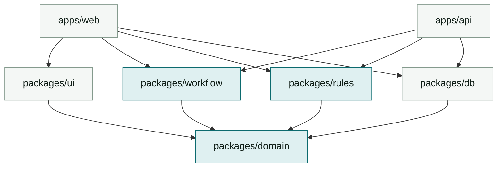

# Plan 01 -- Repo & Build Architecture

Addresses assessment criteria #2 (repo/monorepo structure) and #4 (CI/CD).

## Layout

```
agentic-assignment/
+-- apps/
|   +-- web/                 Angular 22 app  -> Vercel project "lj-web"
|   +-- api/                 Vercel serverless functions (Node 24, TS)
+-- packages/
|   +-- domain/              Entities, Zod schemas, shared TS types. Zero deps.
|   +-- workflow/            State machine engine + the 3 machine definitions
|   +-- rules/               Rule engine + eligibility / document / credit rule sets
|   +-- db/                  Supabase generated types, client factories, query helpers
|   +-- ui/                  Shared Angular standalone components (design primitives)
+-- supabase/
|   +-- migrations/          Timestamped SQL, checked in
|   +-- seed.sql             Demo lender, products, borrower, one funded loan
+-- tooling/
|   +-- eslint-config/
|   +-- tsconfig/            base.json, angular.json, node.json
+-- .github/workflows/ci.yml
+-- turbo.json
+-- pnpm-workspace.yaml
```

**Dependency direction is strictly one way:**



An arrow reads "depends on". Nothing points upward, and `packages/domain` depends on nothing.
The tinted nodes are the pure layer.

`domain`, `workflow`, and `rules` are **pure TypeScript with no I/O and no framework imports.**
That is what lets the browser and the serverless function run byte-identical logic -- the client
predicts the transition for instant UI, the server decides it. See `03`.

## Pinned toolchain

**Single source of truth for versions.** Every other document refers here rather than repeating a
number. Verified against the npm registry and the Actions marketplace on 2026-09-01.

| Tool | Pin | Why this one |
|---|---|---|
| Node | `24.20.0` (Active LTS, "Krypton") | Angular 22's engines accept `^22.22.3 \|\| ^24.15.0 \|\| >=26.0.0`. 26 is Current, not LTS; CI pins LTS. |
| pnpm | `11.25.0` | Workspaces, strict `node_modules`. |
| Turborepo | `2.10.12` | `turbo.json` uses the v2 `tasks` key, not the v1 `pipeline` key. |
| Angular | `22.1.6` CLI / `22.1.4` core | Fixed by the brief. |
| Angular Material + CDK | `22.1.4` | Must match `@angular/core` exactly, not by caret. |
| **TypeScript** | **`6.0.3`** | **Not `latest`.** See the warning below. |
| Tailwind CSS | `4.3.3` | v4 is CSS-first. There is no `tailwind.config.js`. |
| Zod | `4.5.4` | |
| Vitest | `4.1.11` | |
| `@supabase/supabase-js` | `2.112.4` | |
| Supabase CLI | `2.116.0` | Runs the local stack in Docker. |
| Vercel CLI | `59.11.0` | Only needed to publish. |

### The TypeScript trap

npm's `latest` tag for TypeScript is **`7.0.2`**, and installing it breaks the build.
`@angular/compiler-cli@22` declares `"typescript": ">=6.0 <6.1"`, so the supported version is
**`6.0.3`**. Pin it exactly, in the root `package.json`, with no caret:

```json
"typescript": "6.0.3"
```

This is the kind of thing that looks fine until `ng build` fails with an unhelpful error, and it
is worth knowing before Phase 0 rather than during it.

## Package manager & tooling

- **pnpm workspaces** (`pnpm-workspace.yaml`). Chosen over npm for strict node_modules -- it
  surfaces phantom dependencies, which matters when five packages share one graph.
- Internal packages are consumed as **TS source, not built dist** (`"exports": "./src/index.ts"`,
  `publishConfig` unused). One less build step; Angular's and Vercel's bundlers both handle it.
  Trade-off: `typecheck` must run repo-wide, which it does anyway.
- **Every workspace package is named `@lj/<dir>`** -- `packages/domain` is `@lj/domain`,
  `apps/web` is `@lj/web`. The directory name and the package name are independent in npm, so
  the convention has to be stated or nine manifests will disagree. A scope makes an internal
  import unmistakable at a glance: `@lj/rules` cannot be confused with a package from the
  registry, and `import { ... } from '@lj/domain'` reads as a layer crossing, which is what the
  ESLint layering rule in `../CLAUDE.md` is watching for. The scope is never published; every
  manifest is `"private": true`.
- **Dependencies between packages are declared with `workspace:*`**, not by a relative path or a
  `tsconfig` path alias alone. This is not bookkeeping: the manifests are the only place
  Turborepo learns the graph. A package that is imported in TypeScript but absent from
  `dependencies` is invisible to Turbo, which will then order the two tasks wrongly and let
  `turbo-ignore` cancel a Vercel build that should have run.

## turbo.json

```jsonc
{
  "$schema": "https://turbo.build/schema.json",
  "globalDependencies": ["pnpm-lock.yaml", "tooling/tsconfig/**", ".node-version"],
  "tasks": {
    "build": {
      "dependsOn": ["^build", "typecheck"],
      "outputs": ["dist/**"],
      "env": ["SUPABASE_URL", "SUPABASE_ANON_KEY", "VERCEL_ENV"]
    },
    "typecheck": { "dependsOn": ["^typecheck"], "outputs": [] },
    "lint":      { "dependsOn": ["^lint"], "outputs": [] },
    "test":      { "dependsOn": ["^build"], "outputs": ["coverage/**"] },
    "dev":       { "cache": false, "persistent": true }
  }
}
```

Note `env` on `build`: Turbo hashes those into the cache key, so a changed Supabase URL
correctly busts the cache instead of serving a stale bundle. This is the classic monorepo
footgun and is worth mentioning in the interview.

## "Vercel builds only what changed"

The brief names this explicitly, so it must actually work and be demonstrable.

Two Vercel projects (`lj-web` -> `apps/web`, `lj-api` -> `apps/api`), both with **Root Directory**
set to the app and **Ignored Build Step** set to:

```bash
npx turbo-ignore --fallback=HEAD^1
```

`turbo-ignore` asks Turbo whether the app's dependency subgraph changed between the last
successful deploy's SHA and this one. Editing `packages/rules` rebuilds both apps; editing
`apps/web/src/styles.css` rebuilds only web; editing `README.md` rebuilds neither.

**Demonstrate it in the submission README** with two commits and two screenshots of the Vercel
log ("Build cancelled -- no changes detected"). An unproven claim here is worth nothing.

**Remote cache is deliberately not used.** The brief fixes Turborepo and requires that Vercel
build only what changed; it never mentions caching, and no assessment criterion touches it.
`turbo-ignore` answers the changed-only question from the dependency graph and a git diff, so it
needs no cache, no account and no token. The local cache under `.turbo/` is still active and is
what makes the inner loop fast. Adding a remote cache would buy CI seconds at the cost of a
credential in the pipeline, which is the wrong trade under **Security** in `../CLAUDE.md`.

## Local dev

```bash
pnpm i
supabase start                 # local Postgres + Auth on :54321
pnpm db:reset                  # migrations + seed
pnpm dev                       # turbo dev --filter=web --filter=api
```

`pnpm db:reset` = `supabase db reset` -- migrations are the only way schema changes happen. No
clicking in the Supabase dashboard; the dashboard is for inspection.

## Why an `apps/api` at all, given Supabase

Supabase RLS could serve the whole app from the browser. We add a thin serverless API for one
reason: **workflow transitions must be adjudicated somewhere the client cannot lie.** Reads go
direct to Supabase (RLS-protected, fewer hops, realtime subscriptions work). Writes that move a
state machine go through `POST /api/transition`. That split is the design argument to defend --
see `03-workflow-engine.md`.
