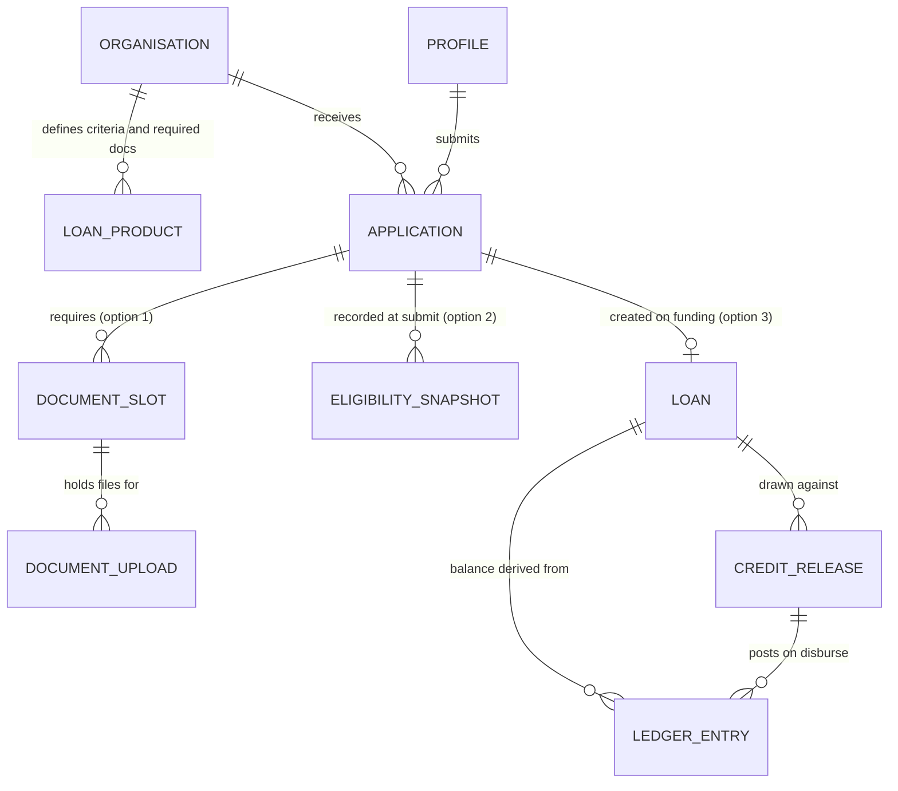

# Plan 02 -- Domain Model, Roles & RLS

## The unifying entity

Everything hangs off one aggregate: the **loan file**. Option 2 creates it, Option 1 fills its
document pack, Option 3 services it after funding.



`APPLICATION` is the aggregate root and carries the workflow state. Option 2 creates it, option 1
fills its document pack, option 3 begins at `LOAN`. `application.data` (the multi-step form
payload) is a JSONB column on `APPLICATION`, not a table.

`WORKFLOW_EVENT` is deliberately outside this diagram: it references
`(machine, subject_id)` rather than a foreign key, because one append-only log serves all three
machines. That is a trade - no referential integrity on `subject_id` - taken so the event log,
the audit trail and the timeline component stay single implementations.


## Schema sketch

```sql
-- identity ---------------------------------------------------------------
create type app_role as enum ('borrower', 'lender', 'admin');

create table profile (
  id           uuid primary key references auth.users on delete cascade,
  role         app_role not null default 'borrower',
  org_id       uuid references organisation(id),   -- null for borrowers
  full_name    text,
  created_at   timestamptz not null default now()
);

-- products & rules -------------------------------------------------------
create table loan_product (
  id            uuid primary key default gen_random_uuid(),
  org_id        uuid not null references organisation(id),
  name          text not null,
  min_amount    numeric, max_amount numeric,
  criteria      jsonb not null,   -- declarative rule set, see packages/rules
  required_docs jsonb not null,   -- doc slot definitions, see 04
  active        boolean not null default true
);

-- the aggregate ----------------------------------------------------------
create table application (
  id             uuid primary key default gen_random_uuid(),
  borrower_id    uuid not null references profile(id),
  org_id         uuid not null references organisation(id),
  state          text not null default 'draft',      -- validated by trigger
  revision       integer not null default 0,          -- optimistic concurrency
  data           jsonb not null default '{}',         -- form payload
  furthest_step  text,                                -- resume hint
  submitted_at   timestamptz,
  decided_at     timestamptz,
  decision_note  text,                                -- LENDER ONLY
  risk_grade     text,                                -- LENDER ONLY
  created_at     timestamptz not null default now(),
  updated_at     timestamptz not null default now()
);

-- the log ----------------------------------------------------------------
create table workflow_event (
  id            bigserial primary key,
  machine       text not null,        -- 'application' | 'document' | 'credit_release'
  subject_id    uuid not null,
  from_state    text,
  to_state      text not null,
  event         text not null,        -- the transition name, e.g. 'submit'
  actor_id      uuid references profile(id),
  actor_role    app_role,
  payload       jsonb,
  created_at    timestamptz not null default now()
);
create index on workflow_event (machine, subject_id, id);

-- legal transitions, GENERATED from packages/workflow (see 03) ------------
create table workflow_transition (
  machine    text not null,
  from_state text not null,
  event      text not null,
  to_state   text not null,
  actor_role app_role not null,
  primary key (machine, from_state, event, actor_role)
);
```

`document_slot`, `document_upload`, `loan`, `ledger_entry`, `credit_release` are detailed in
`04` and `06`.

## Two roles, two truths

The brief's Option 3 hook -- *"two roles seeing different truths from the same data"* -- is
implemented at the **projection** layer, not by duplicating tables.

```sql
create view application_borrower_v as
  select id, borrower_id, org_id, state, revision, data, furthest_step,
         submitted_at, decided_at, created_at, updated_at
  from application;                       -- note: no decision_note, no risk_grade

create view application_lender_v as
  select a.*, p.full_name as borrower_name,
         (select count(*) from document_slot d
           where d.application_id = a.id and d.state <> 'accepted') as open_doc_count
  from application a join profile p on p.id = a.borrower_id;
```

Column-level omission in a view is honest and enforceable; hiding a field in the Angular
template is not. The API returns whichever view matches `profile.role`.

The other half of "different truths" is **state labelling**. The same `state` value reads
differently per audience, and that mapping lives in `packages/domain`:

| `state` | Borrower sees | Lender sees |
|---|---|---|
| `under_review` | "With your lender" | "Awaiting your decision" |
| `needs_borrower_action` | "Action needed from you" | "Waiting on borrower" |
| `approved` | "Approved" | "Approved -- awaiting funding" |

One state, two vocabularies. Cheap to build, and it is exactly the point the brief is probing.

## RLS

RLS is on for every table. Policies are the security boundary; the API is a convenience layer,
never the only gate.

```sql
alter table application enable row level security;

create policy app_borrower_read on application for select
  using (borrower_id = auth.uid());

create policy app_lender_read on application for select
  using (org_id = (select org_id from profile where id = auth.uid())
         and (select role from profile where id = auth.uid()) = 'lender');

-- Borrowers may edit their own DRAFT payload directly (fast autosave path).
create policy app_borrower_draft_write on application for update
  using (borrower_id = auth.uid() and state = 'draft')
  with check (borrower_id = auth.uid() and state = 'draft');
```

Note what that last policy does **not** allow: it cannot change `state`, because a
`BEFORE UPDATE` trigger rejects any `state` change whose tuple is absent from
`workflow_transition`. Drafts autosave straight from the browser (fast, no cold start); state
moves only via the API's service role. See `03`.

## Seed data

`supabase/seed.sql` must produce a demo that is walkable in 60 seconds during the CTO session:

- 1 lender org, 2 loan products with genuinely different criteria (an operating line with a
  DSCR floor; an equipment loan with an LTV cap) so eligibility visibly diverges.
- 1 borrower with a **funded** loan and ledger history -> Option 3 has something to show
  immediately, without walking Option 2 first.
- 1 borrower mid-application at `docs_pending` with 2 of 5 slots filled, one of them **expired**
  and one **inconsistent** -> Option 1 shows its interesting state on first load.
- 1 borrower at `draft` on step 3 -> demonstrates resume.

Seeding the *interesting* states rather than empty tables is what makes the demo land.
