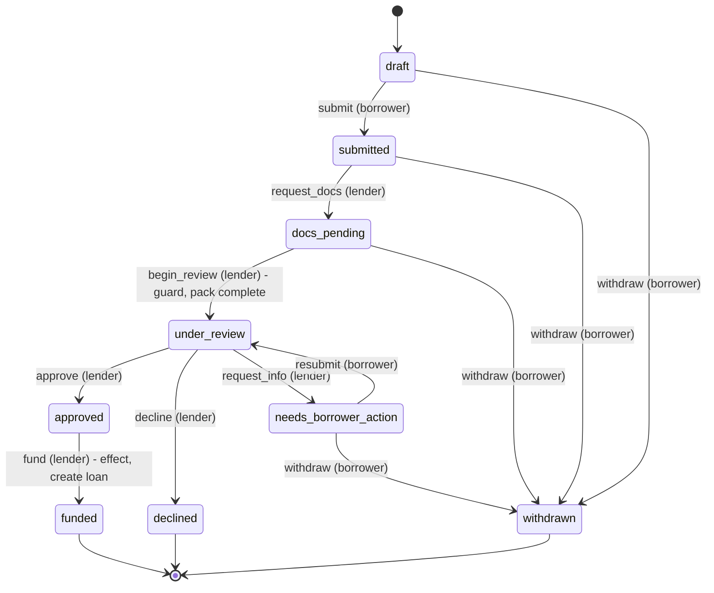
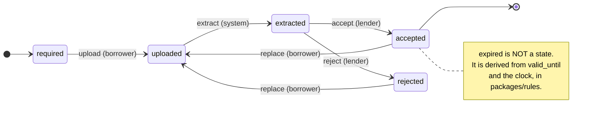
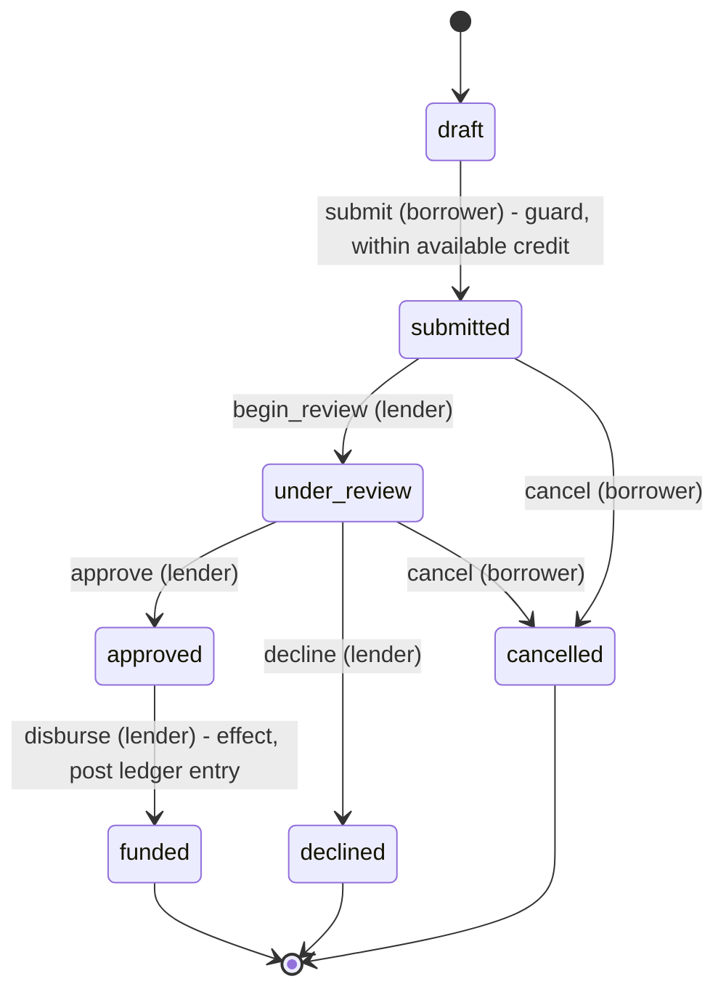
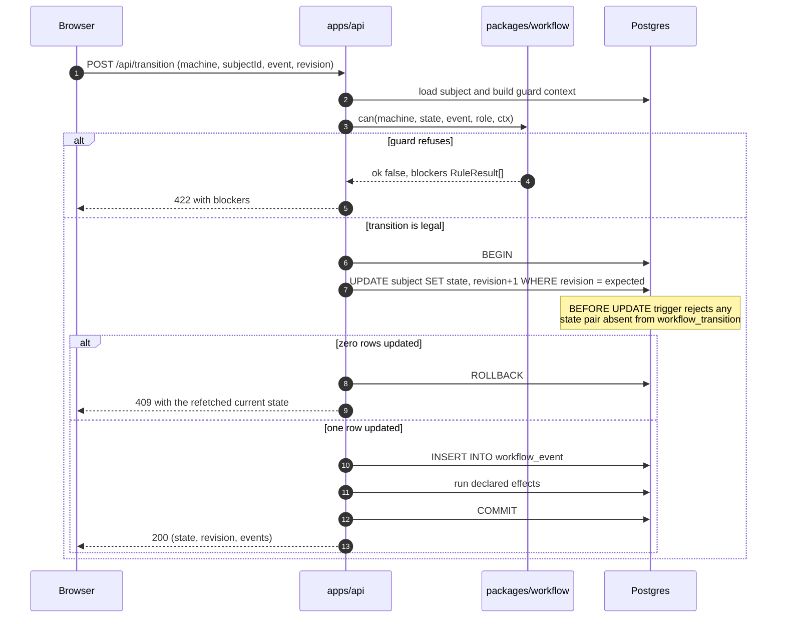

# Plan 03 -- The Workflow Engine

Assessment criterion #5, and the brief's most pointed constraint:

> Do not reach for Temporal, Inngest or similar. We want your design thinking, not a vendor's
> quickstart. ... what the states are, what transitions are legal, where the state lives, and what
> happens if someone closes the tab mid-way and comes back.

Four questions. Answered in order below.

---

## 1. What the states are

Three machines, one engine. Definitions live in `packages/workflow/src/machines/`.

### `application` (Option 2 -> Option 1 -> funding)



`funded` is terminal for this machine and is the **hand-off point**: funding creates a `loan`
row, and Option 3's machines take over. Two machines, one seam -- not one sprawling machine.

### `document_slot` (Option 1) -- per required document, not per file



**`expired` is deliberately not a state.** Expiry is a function of `valid_until` and the clock:
a state machine whose states change without an event is a machine that lies. `expired` is a
*derived status* computed in `packages/rules`. This distinction is worth stating in the
interview -- it is the difference between modelling and hand-waving.

### `credit_release` (Option 3)



## 2. What transitions are legal

A machine is data, not code:

```ts
// packages/workflow/src/types.ts
export interface Transition<S extends string, E extends string, Ctx> {
  from: S | S[];
  event: E;
  to: S;
  /** Which role may fire this. */
  actor: AppRole[];
  /** Pure predicate. No I/O -- everything it needs is in ctx. */
  guard?: (ctx: Ctx) => GuardResult;
  /** Declarative side effects, executed transactionally by the runner. */
  effects?: EffectSpec[];
}

export type GuardResult = { ok: true } | { ok: false; reason: string; blockers: RuleResult[] };
```

```ts
// machines/application.ts  (excerpt)
export const applicationMachine = defineMachine({
  id: 'application',
  initial: 'draft',
  transitions: [
    { from: 'draft', event: 'submit', to: 'submitted', actor: ['borrower'],
      guard: ctx => requireAll(ctx, [
        stepsComplete(ctx.data),
        atLeastOneEligibleProduct(ctx.eligibility),
      ]) },
    { from: 'docs_pending', event: 'begin_review', to: 'under_review', actor: ['lender'],
      guard: ctx => documentPackComplete(ctx.slots) },
    { from: 'under_review', event: 'approve', to: 'approved', actor: ['lender'] },
    { from: 'approved', event: 'fund', to: 'funded', actor: ['lender'],
      effects: [{ kind: 'create_loan' }] },
    // ...
  ],
});
```

Guards return **why** they failed, as `RuleResult[]` -- the same type the rules engine produces
(`05`). So a blocked transition renders through the exact same UI component as an unmet
eligibility criterion. One vocabulary for "you cannot proceed, and here is precisely why."

### Legality is enforced twice, defined once

The machine definition is the single source of truth. A codegen step flattens it into SQL:

```bash
pnpm workflow:gen   # packages/workflow -> supabase/migrations/<ts>_transitions.sql
```

...which seeds `workflow_transition`. A `BEFORE UPDATE` trigger on `application`, `document_slot`
and `credit_release` rejects any state change not present in that table.

```sql
create or replace function assert_legal_transition() returns trigger as $$
begin
  if new.state is distinct from old.state
     and not exists (select 1 from workflow_transition t
                     where t.machine = tg_argv[0]
                       and t.from_state = old.state and t.to_state = new.state) then
    raise exception 'illegal transition % -> % on %', old.state, new.state, tg_argv[0]
      using errcode = 'check_violation';
  end if;
  return new;
end $$ language plpgsql;
```

Guards (which need context) run in TypeScript; shape legality (which does not) runs in Postgres.
Even a leaked service key or a bug in the API cannot write a nonsense state. **Belt in the type
system, braces in the database, generated from one definition so they cannot drift.**

## 3. Where the state lives

**The server. Always.** The client holds a *prediction*, never the truth.



The **event log is the audit trail and the explanation**: "Submitted 14 Aug | Docs requested
15 Aug | Under review 18 Aug" is a `select * from workflow_event` render, and the same component
serves borrower and lender with different labels (`02`).

Because `packages/workflow` is framework-free, the browser imports the same `engine.can()` to
grey out illegal buttons and show guard blockers **before** a round-trip. Same code, two roles:
client predicts, server decides. If they ever disagree, the server wins and the client refetches.

## 4. What happens if someone closes the tab

Three layers, cheapest first:

**a) The URL is the position.** Routes are `/apply/:id/:step` and `/loans/:id/release/:releaseId`.
A refresh restores the step because the step is in the address bar. A route guard re-derives
reachability from server state -- deep-linking to step 4 of an application still on step 2
redirects to the furthest legal step, it does not render a broken form.

**b) The server holds the draft.** The multi-step form autosaves `application.data` (JSONB) on a
**800 ms debounce plus on step change plus on `visibilitychange -> hidden`** (the last one is what
actually catches a closing tab; `beforeunload` is unreliable and cannot await a fetch -- use
`navigator.sendBeacon`). `furthest_step` is written alongside.

**c) localStorage is the seatbelt, not the belt.** Key `lj:draft:<applicationId>`, holding
`{ revision, updatedAt, data }`. On load: render local instantly, fetch server, then reconcile --
if `local.updatedAt > server.updatedAt` **and** `local.revision === server.revision`, the user
lost a flush (offline, killed tab); offer "Restore unsaved changes from 4 minutes ago?" rather
than silently overwriting. If revisions differ, the server changed underneath: discard local and
tell them. Never resolve a conflict by guessing.

**Concurrency is the same mechanism.** `revision` is checked on every transition. Two lender tabs
approving the same release: the second gets 409, refetches, and sees it is already approved.
This is demonstrable live in the interview with two browser windows -- worth rehearsing.

## Testing

The engine and the machine definitions are pure, so they are cheap to test properly, and this is
the one place tests earn their keep:

- Every transition in every machine: legal from its `from` states, rejected from all others.
- Every guard: one passing and one failing context, asserting the `reason` string.
- A **reachability test** -- every non-initial state is reachable from `initial`, and every
  terminal state is genuinely terminal. Catches orphan states after an edit.
- A **parity test** -- the generated SQL table matches the TS definition exactly. This is the
  test that stops belt and braces from drifting.
